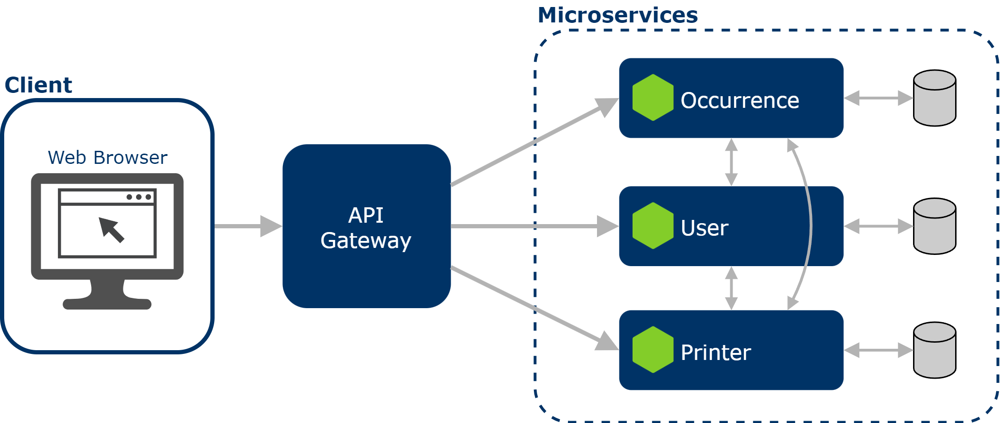

# Arquitetura

## 1. Introdução

O objetivo deste documento é fornecer uma visão clara e compreensiva da estrutura e dos componentes do sistema, incluindo suas interações e dependências, bem como as decisões de design que orientaram sua criação.

## 2. Representação Arquitetural

### 2.1. Componentes

#### Microsserviços

A arquitetura de microsserviços é uma abordagem onde o sistema é dividido em pequenos serviços independentes, cada um responsável por uma tarefa específica. Esses serviços são desenvolvidos, implantados e escalados de forma independente, o que aumenta a flexibilidade, a capacidade de resposta às mudanças e a escalabilidade do sistema. Cada microsserviço possui seu próprio banco de dados e se comunica com outros serviços através de APIs RESTful.

O sistema possui três microsserviços:

- User: Responsável por gerenciar usuários da aplicação.
- Printer: Realiza o gerenciamento de impressoras e impressões.
- Occurrence: Gerencia ocorrências.

#### Interface de Usuário

A interface de usuário para o sistema será uma interface web, acessível através de navegadores modernos. A escolha de uma interface web traz vários benefícios, incluindo acessibilidade, facilidade de distribuição e compatibilidade com diversos dispositivos.

#### API Gateway

O API Gateway é um componente crucial na arquitetura de microsserviços, atuando como um ponto de entrada único para todas as chamadas de API feitas aos diversos microsserviços. O API Gateway recebe todas as requisições de clientes e as roteia para o microsserviço apropriado utilizando regras de roteamento configuradas para determinar para qual serviço a requisição deve ser encaminhada.

### 2.2. Diagrama de Arquitetura

O diagrama de arquitetura apresentado a seguir ilustra a estrutura do sistema:

### 2.3. Tecnologias

#### React

ReactJS é uma biblioteca JavaScript amplamente utilizada para criar interfaces de usuário interativas em aplicações web e móveis. Ele simplifica o desenvolvimento ao dividir a interface em componentes reutilizáveis e oferece uma maneira eficiente de atualizar e renderizar elementos na tela, proporcionando uma experiência de usuário fluida e responsiva.

#### NodeJS

Node.js é uma plataforma de backend baseada em JavaScript, ideal para construir serviços eficientes e escaláveis. Ele permite operações assíncronas e não bloqueantes, facilitando a construção de APIs RESTful e integração com bancos de dados, adequando-se bem à arquitetura de microsserviços moderna.

#### PostgreSQL

PostgreSQL é um sistema de banco de dados relacional de código aberto conhecido por sua confiabilidade e robustez. Ele suporta consultas complexas, transações seguras e oferece recursos avançados como indexação eficiente e suporte a tipos de dados variados. É amplamente utilizado em aplicações que requerem armazenamento estruturado e confiável de dados.

## 3. Referências Bibliográficas

> About PostgreSQL. Disponível em: [https://www.postgresql.org/about/](https://www.postgresql.org/about/)

> What is Node.js. Disponível em: [https://developer.oracle.com/learn/technical-articles/what-is-node-js](https://developer.oracle.com/learn/technical-articles/what-is-node-js)

> React. Disponível em: [https://react.dev/](https://react.dev/)

> IBM - O que são microsserviços? Disponível em [https://www.ibm.com/br-pt/topics/microservices](https://www.ibm.com/br-pt/topics/microservices)

## 4. Versionamento

|**Data**|**Descrição**|**Autor(es)**|
|:-:|---|---|
| 14/07/2024 | Criação do Documento | Lucas Braun |
