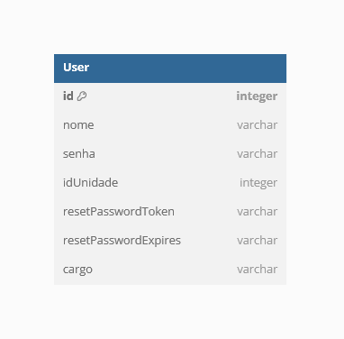

# Arquitetura

## 1. Introdução

O objetivo deste documento é fornecer uma visão clara e compreensiva da estrutura e dos componentes do sistema, incluindo suas interações e dependências, bem como as decisões de design que orientaram sua criação.

## 2. Representação Arquitetural

### 2.1. Componentes

#### Microsserviços

A arquitetura de microsserviços é uma abordagem onde o sistema é dividido em pequenos serviços independentes, cada um responsável por uma tarefa específica. Esses serviços são desenvolvidos, implantados e escalados de forma independente, o que aumenta a flexibilidade, a capacidade de resposta às mudanças e a escalabilidade do sistema. Cada microsserviço possui seu próprio banco de dados e se comunica com outros serviços através de APIs RESTful.

O sistema possui três microsserviços:

- User: Responsável por gerenciar usuários da aplicação.
- Printer: Realiza o gerenciamento de impressoras e impressões.
- Occurrence: Gerencia ocorrências.
- Contract: Gerencia dados de contratos.

#### Interface de Usuário

A interface de usuário para o sistema será uma interface web, acessível através de navegadores modernos. A escolha de uma interface web traz vários benefícios, incluindo acessibilidade, facilidade de distribuição e compatibilidade com diversos dispositivos.

#### API Gateway

O API Gateway é um componente crucial na arquitetura de microsserviços, atuando como um ponto de entrada único para todas as chamadas de API feitas aos diversos microsserviços. O API Gateway recebe todas as requisições de clientes e as roteia para o microsserviço apropriado utilizando regras de roteamento configuradas para determinar para qual serviço a requisição deve ser encaminhada.

### 2.2. Diagrama de Arquitetura

O diagrama de arquitetura apresentado a seguir ilustra a estrutura do sistema:

### 2.3. Tecnologias

#### React

ReactJS é uma biblioteca JavaScript amplamente utilizada para criar interfaces de usuário interativas em aplicações web e móveis. Ele simplifica o desenvolvimento ao dividir a interface em componentes reutilizáveis e oferece uma maneira eficiente de atualizar e renderizar elementos na tela, proporcionando uma experiência de usuário fluida e responsiva.

#### NodeJS

Node.js é uma plataforma de backend baseada em JavaScript, ideal para construir serviços eficientes e escaláveis. Ele permite operações assíncronas e não bloqueantes, facilitando a construção de APIs RESTful e integração com bancos de dados, adequando-se bem à arquitetura de microsserviços moderna.

#### PostgreSQL

PostgreSQL é um sistema de banco de dados relacional de código aberto conhecido por sua confiabilidade e robustez. Ele suporta consultas complexas, transações seguras e oferece recursos avançados como indexação eficiente e suporte a tipos de dados variados. É amplamente utilizado em aplicações que requerem armazenamento estruturado e confiável de dados.

## 3. Visão de dados

### Modelo Entidade-Relacionamento (MER)

Um Modelo Entidade-Relacionamento (MER) é uma representação que descreve a estrutura de um banco de dados. Ele utiliza três componentes principais: entidades, que representam objetos ou conceitos; atributos, que são as propriedades dessas entidades; e relacionamentos, que mostram como as entidades estão associadas entre si. O MER facilita a compreensão e o planejamento do banco de dados antes de sua implementação, garantindo que todas as necessidades de dados e suas interações sejam consideradas.

Em uma arquitetura de microsserviços, cada serviço possui seu próprio banco de dados, mas pode referenciar dados de outros serviços usando IDs ou chaves simbólicas, garantindo a independência e a comunicação via APIs.

### Diagrama Lógico de Dados (DLD)

O Diagrama Lógico de Dados (DLD) é uma representação gráfica detalhada que descreve a estrutura de um banco de dados em termos de tabelas e suas relações. Ele é uma evolução do Modelo Entidade-Relacionamento (MER) e visa fornecer uma visão mais específica e técnica da organização dos dados, facilitando a implementação no banco de dados físico.

### 3.1. Printer Service

#### MER

Entidades:

- EQUIPAMENTO
- MODELO

Atributos:

- IMPRESSORA
    - <ins>id</ins>
    - numContrato
    - numSerie
    - enderecoIp
    - estaNaRede 
    - dataInstalacao
    - dataRetirada 
    - ativo 
    - contadorInstalacaoPB 
    - contadorInstalacaoCor 
    - contadorAtualPB 
    - contadorAtualCor 
    - contadorRetiradaPB 
    - contadorRetiradaCor 
    - localizacao 
    - padraoId 

- PADRAO
    - <ins>id</ins>
    - nome
    - modelo
    - colorido
    - ativo
    - oidModelo
    - oidNumeroSerie
    - oidFirmware
    - oidTempoAtivo
    - oidDigitalizacoes
    - oidCopiasPB
    - oidCopiasCor
    - oidTotalGeral

Relacionamentos:

- IMPRESSORA ***pertence*** a um MODELO
    - Uma impressora pertence a apenas um modelo, mas um único modelo pode ter várias impressoras.
    - Cardinalidade 1:n

#### DLD

### 3.2. User Service

#### MER

Entidades:

- USER

Atributos:

- USER
    - <ins>id</ins>
    - email
    - nome
    - senha
    - idUnidade
    - resetPasswordToken
    - resetPasswordExpires
    - cargo

#### DLD

### 3.3. Contract Service

#### MER

Entidades:

- CONTRATO

Atributos:

- CONTRATO:
    - <ins>id</ins>
    - numero
    - idGestor
    - descricao
    - dataInicio
    - dataTermino
    - ativo

#### DLD

## 4. Pacotes

Um diagrama de pacotes é uma ferramenta visual usada na engenharia de software para representar a organização de um sistema em termos de módulos e suas interações. Ele agrupa componentes relacionados, como classes e interfaces, dentro de "pacotes", ajudando a estruturar o sistema de forma mais clara e organizada.

Esses diagramas são úteis para identificar e analisar as dependências entre diferentes partes do sistema, promovendo um design mais coeso e menos acoplado. Além disso, eles facilitam a comunicação entre os membros da equipe de desenvolvimento, fornecendo uma visão clara da arquitetura do sistema.

### 4.1. Diagrama de Pacotes

#### Front-end

#### Back-end - Microsserviço

## 5. Referências Bibliográficas

> About PostgreSQL. Disponível em: [https://www.postgresql.org/about/](https://www.postgresql.org/about/)

> What is Node.js. Disponível em: [https://developer.oracle.com/learn/technical-articles/what-is-node-js](https://developer.oracle.com/learn/technical-articles/what-is-node-js)

> React. Disponível em: [https://react.dev/](https://react.dev/)

> IBM - O que são microsserviços? Disponível em [https://www.ibm.com/br-pt/topics/microservices](https://www.ibm.com/br-pt/topics/microservices)

> Diagrama de Pacotes: Definição, Componentes e Exemplos. Disponível em: [https://gitmind.com/pt/diagrama-de-pacotes.html](https://gitmind.com/pt/diagrama-de-pacotes.html)

## 6. Versionamento

|**Data**|**Descrição**|**Autor(es)**|
|:-:|---|---|
| 14/07/2024 | Criação do Documento | Lucas Braun |
| 22/07/2024 | Corrige diagrama e serviços | Lucas Braun |
| 26/07/2024 | Adiciona DLD's | Lucas Braun |
| 28/07/2024 | Adiciona diagramas de pacotes | Lucas Braun |
