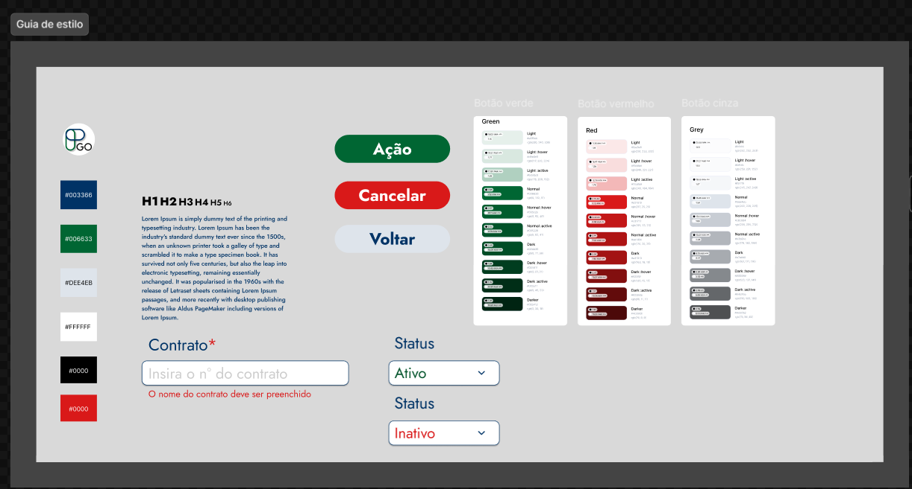
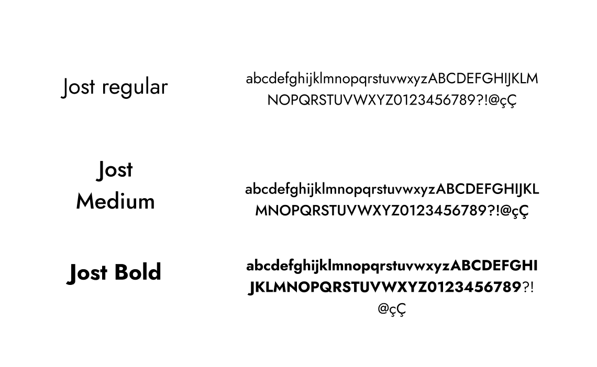
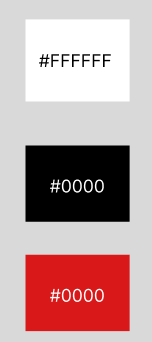
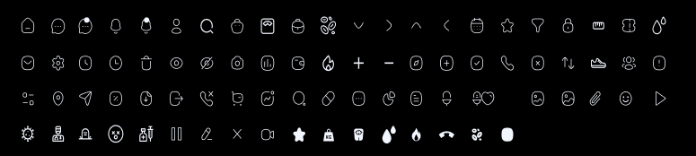

# Guia de estilo

## 1. Introdução

O guia de estilo é um conjunto de diretrizes que estabelece padrões e regras para a escrita e apresentação de design para um produto.
Tem como principal objetivo ajudar a manter a consistência na comunicação visual do projeto, aumentando a sua legibilidade, reconhecimento e memorização pelo público-alvo. Ele pode ser encontrado nesse [link](https://www.figma.com/design/nMiS0y8QcqYYUm4kV6CXba/prototipo-printGo?node-id=329-4113&t=qGfiwgM7LU7An8YZ-1)

  

## 2. Logo

  

### 3 Tipografia

A principal família tipográfica definida para o projeto é a Jost e suas variações de estilo.

  

### 3.1 Cores

#### Primárias

  

#### Secundárias

  

### 3.2 Ícones

Os icones utilizados na aplicação são obtidos a partir da biblioteca [material-icons](https://mui.com/pt/material-ui/material-icons/)

  

## 4. Referências

> [1] Style Guide. Disponivel em: https://aelaschool.com/designvisual/style-guide-como-desenvolver-o-guia-de-estilo-da-sua-interface/

> [2] Material UI. Disponível em: https://mui.com/pt/material-ui

## 5. Histórico da versão

| **Data**   | **Descrição**                       | **Autor(es)**         |
| ---------- | ----------------------------------- | --------------------- |
| 03/10/2023 | Criação do documento guia de estilo | Júlia Farias Sousa |
| 03/10/2023 | Alteração das cores | Júlia Farias Sousa, Lucas Lima, Yuri Alves|
| 03/10/2023 | Revisão do Documento | Davi Matheus da Rocha de Oliveira |
| 27/07/2024 | Revisão do Documento para o semestre de 2024.1 | Edilson Ribeiro da Cruz Júnior |