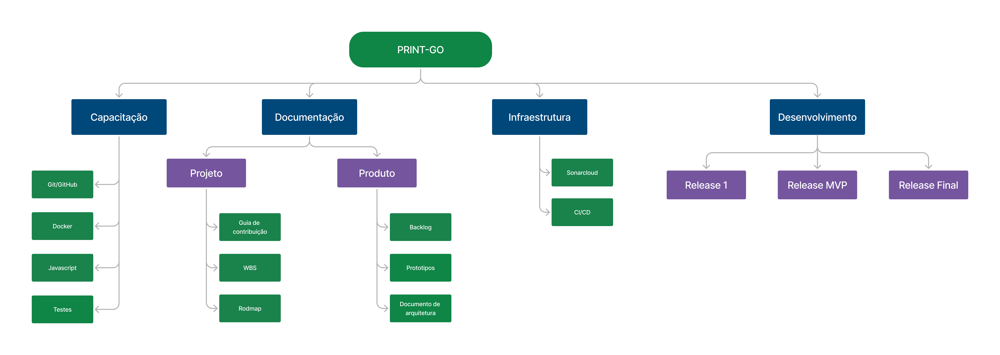

# Work Breakdown Structure (WBS)

## 1. Introdução

A Work Breakdown Structure (WBS) é uma ferramenta de gerenciamento de projetos que descompõe um projeto em partes menores e mais gerenciáveis. A WBS organiza e define o escopo total do projeto, representando hierarquicamente as entregas e os componentes de trabalho que precisam ser executados para concluir o projeto.

## 2. Diagrama

Segue o resultado do nosso Diagrama WBS.

O diagrama também pode ser acessado através desse [link](https://www.figma.com/board/cqj2T54F3zEylR09ZI5VTq/WBS?node-id=0-1&t=qd7mWVftECmPCFpO-0)

## Versionamento

| **Data**   | **Descrição**                          | **Autor(es)**             |
| ---------- | --------------------                   | ------------------------- |
| 11/07/2024 | Criação da v1 do diagrama              | Eliseu Kadesh, Caio Lamego, Matheus Brant |
| 11/07/2024 | Criação da v1 do documento             | Eliseu Kadesh              |