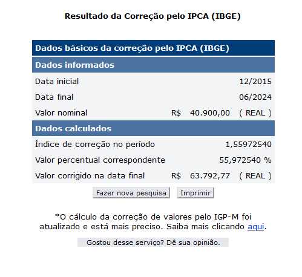

# Plano de custos

## 1. Introdução

&emsp;&emsp;Um plano de custos é uma ferramenta essencial para o planejamento financeiro de qualquer projeto ou empreendimento. Ele envolve a estimativa detalhada de todas as despesas necessárias para alcançar os objetivos propostos, desde custos diretos, como materiais e mão de obra, até custos indiretos, como aluguel e utilidades. Ao elaborar um plano de custos, é possível prever e controlar os gastos, garantir a alocação eficiente dos recursos e assegurar a viabilidade financeira do projeto, facilitando a tomada de decisões estratégicas e a minimização de riscos financeiros.

## 2. Estimativa de custos

&emsp;&emsp;Para calcular a estimativa de custo total do projeto, o cálculo foi separado em pessoas, equipamentos, ferramentas, capacitação e infraestrutura.

### 2.1. Recursos humanos

&emsp;&emsp;Foi utilizado o custo médio anual por aluno de instituto federal. De acordo com o [Jornal da UNESP](https://jornal.unesp.br/2022/06/08/cobranca-de-mensalidade-nao-e-a-solucao-para-o-financiamento-da-universidade-publica/), no ano de 2015, esse custo era de R$40.900 anual por aluno.

&emsp;&emsp;É necessário adaptar os dados à inflação atual, ano 2024. Após aplicar essa correção utilizando a calculadora de inflação do [IBGE](https://www3.bcb.gov.br/CALCIDADAO/publico/corrigirPorIndice.do?method=corrigirPorIndice#), utilizando o índice de IPCA, com data inicial de 12/2015 e final 06/2024, o valor passa a ser R$ 63.792,77 anual.

Fonte: IBGE, 2024

&emsp;&emsp;Além disso, essa estimativa leva em consideração o curso da equipe, Engenharia de Software, que é um curso de 5 anos, de 232 créditos. Considerando também as 8 semanas de projeto e os 11 integrantes da equipe, temos os seguintes cálculos:

- **Custo médio por crédito**: custo médio anual por integrante x quantidade padrão de anos de curso ÷ quantidade de créditos para formação no curso **` R$ 63.792,77 x 5 ÷ 232 = R$ 1.374,84 `**

- **Custo médio por integrante na disciplina de EPS/MDS**: custo médio por crédito x quantidade de créditos da disciplina e extraclasse **`R$ 1.374,84 x 4 = R$ 5.499,38`**

- **Custo médio semanal por integrante**: custo por integrante ÷ quantidade de semanas do projeto **`R$ 5.499,38 ÷ 17 = R$ 323,49`**

### 2.2. Equipamentos

&emsp;&emsp;Para estimar os custos com equipamentos, que não são recorrentes, consideramos o preço de um notebook com configurações mínimas. De acordo com os sites de venda, o preço de um notebook é de aproximadamente R$ 3.400,00. Levando em conta os 11 integrantes da equipe:

- **Custo TOTAL dos equipamentos**: custo médio do notebook x quantidade de integrantes da equipe **`3400 x 11 =  R$ 37.400,00`**

### 2.3. Ferramentas
&emsp;&emsp;Sem custos.

### 2.4. Capacitação
&emsp;&emsp;Sem custos.

### 2.5. Infraestrutura
&emsp;&emsp;A estimativa de custos de infraestrutura levou em consideração o uso de energia elétrica e internet.

#### 2.5.1. Internet
&emsp;&emsp;Para cálculo do custo de internet utilizaremos um plano de R$ 90,00 por mês.

- **Custo semanal de internet por integrante**: custo mensal da internet ÷ quantidade de semanas no mês **`90 ÷ 4 = R$ 22,50`**

#### 2.5.2. Energia

&emsp;&emsp;Para a estimativa de energia, seguiu-se os dados da [tabela de tarifas](https://www.neoenergia.com/web/brasilia/sua-casa/composicao-tarifaria) da [neoenergiabrasilia](https://www.neoenergia.com/web/brasilia), com os dados vigentes de 2024. Segundo essa tabela, o custo do KW/h residencial, consumo ativo, de Brasília é cerca de R$ 0,7662. Vamos utilizar o consumo especificado em um dos equipamentos.

- **Custo semanal de energia por integrante**: horas de trabalho x consumo do notebook x tarifa
**`12 x 2,00 x 0,77 = R$ 1,53`**

#### 2.5.3. Custo TOTAL em infraestrutura

&emsp;&emsp;Somando as estimativas de custo semanal de internet (R$ 22,50) e energia (R$ 1,53) por integrante, têm-se um custo semanal de infraestrutura de  R$ 264,36 por integrante.

## 3. Definição do orçamento inicial estimado

&emsp;&emsp;Considerando as estimativas de custos feitas, o orçamento inicial total estimado para o projeto em 17 semanas é de R$ 102.387,20.

## 4. Planilha de custos

<iframe src="https://docs.google.com/spreadsheets/d/e/2PACX-1vRILvIU1GH3WopFw-HqKkzPCfT3uXRwpFWKURi99V6jNi6qUM6RIjYOyYvdnKlO3NgPoiUJJDjTYcD7/pubhtml?widget=true&amp;headers=false" width="100%" height="300"></iframe>

## Referências

> Equipe DNIT 2023-2. Plano de custos. Disponível em <https://fga-eps-mds.github.io/2023.2-Dnit-DOC/plano-monitoramento/plano-custos/>

> Equipe Alectrion 2023-1. Plano de custos. Disponível em: <https://fga-eps-mds.github.io/2023-1-Alectrion-DOC/plano-custos/>

> Neoenergia Brasília. Tarifas. Disponível em: <https://www.neoenergia.com/web/brasilia/sua-casa/composicao-tarifaria> 

> Ministério Público do Estado de Goiás] <https://www.mpgo.mp.br/portal/conteudo/dicas-para-economia-de-energia-ao-usar-o-computador#:~:text=Um%20computador%20ligado%20durante%201,5%2C0%20kwh%2Fm%C3%AAs.>

## Versionamento

|**Data**|**Descrição**|**Autore(es)**|
|--------|-------------|--------------|
|19/07/2024| Criação do documento | Guilherme |
|03/08/2024| Revisão do documento | Guilherme |
